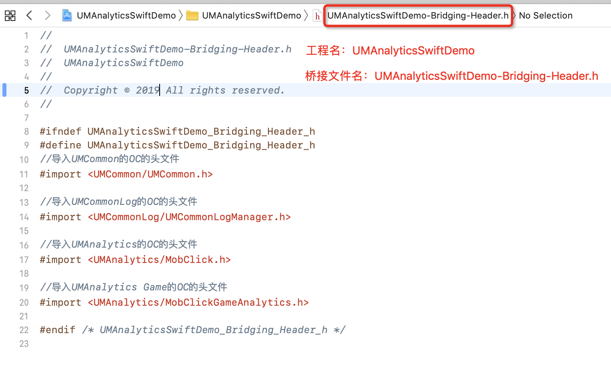
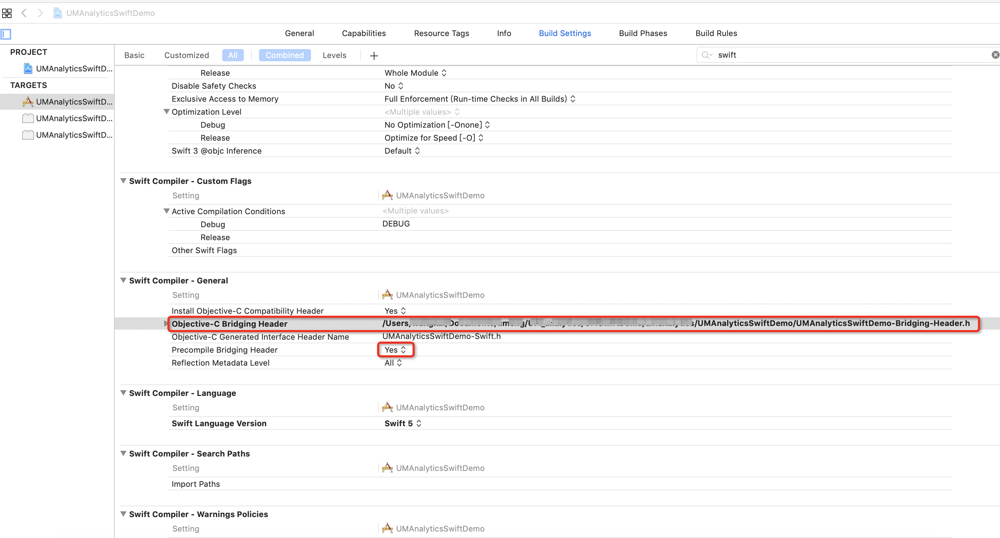
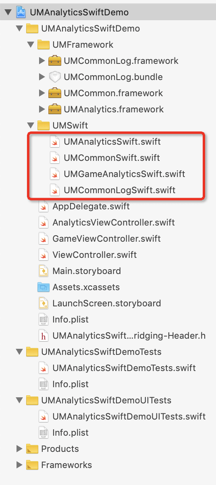

# iOS UMeng OC和Swift混编文档

Swift调用Objective-C需要建立一个桥接头文件进行交互

## 新建桥接头文件

1.该文件在第一次创建Swift文件时会提示创建该文件，选择创建。

2.该文件可以手动创建, 选择Header File文件创建

桥接命名格式为 **工程名-Bridging-Header.h**



## 配置信息

将桥接文件路径拷到Objective-C Bridging Header 里

设置Precompile Bridging Header 为Yes



## 导入SDK头文件

在**工程名-Bridging-Header.h**中加入相应业务SDK的头文件

```
//导入UMCommon的OC的头文件
#import <UMCommon/UMCommon.h>

//导入UMCommonLog的OC的头文件
#import <UMCommonLog/UMCommonLogManager.h>

//导入UMAnalytics的OC的头文件
#import <UMAnalytics/MobClick.h>

//导入UMAnalytics Game的OC的头文件
#import <UMAnalytics/MobClickGameAnalytics.h>

```

导入相对业务桥接文件




**具体使用可参考Demo工程**

**SDK接口使用请参考各业务文档，文档地址：https://developer.umeng.com/docs/119267/cate/119475**
